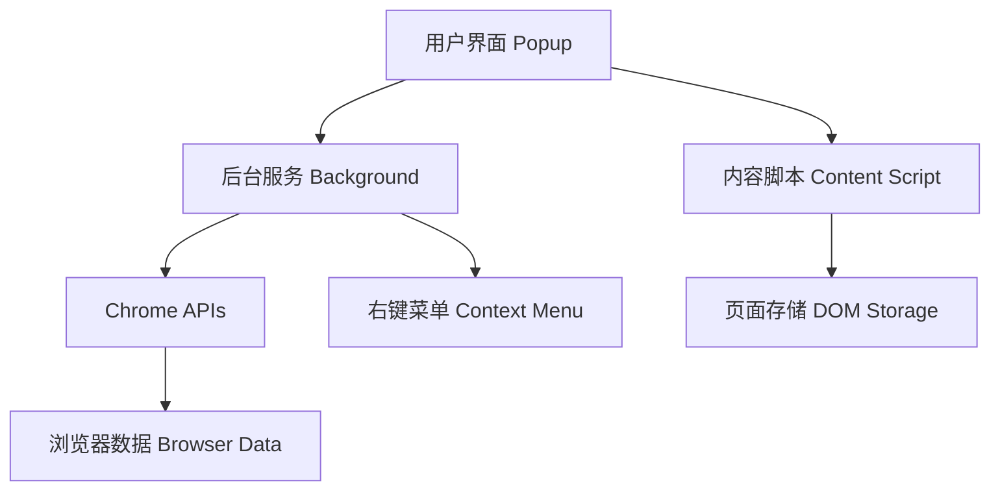

# 🧹 缓存清理助手

_一个功能强大的 Chrome 浏览器扩展，用于快速清理各种类型的浏览器缓存和数据_

[](https://chrome.google.com/webstore)
[](https://developer.chrome.com/docs/extensions/mv3/)
[](LICENSE)
[](manifest.json)

[功能特性](#-功能特性) • [安装指南](#-安装指南) • [使用方法](#-使用方法) • [技术实现](#-技术实现) • [贡献指南](#-贡献指南)

---

## 📋 项目概述

缓存清理助手是一个基于 Manifest V3 的现代化 Chrome 浏览器扩展，提供了全面的缓存清理解决方案。无论是针对单个网站的精确清理，还是整个浏览器的全面清理，都能轻松胜任。

### 🎯 设计理念

- **精确控制** - 支持针对当前网站或全局的清理操作
- **安全可靠** - 提供多重确认机制，防止误操作
- **现代化设计** - 采用最新的 Manifest V3 规范
- **用户友好** - 直观的界面设计和丰富的交互反馈

## ✨ 功能特性

### 🎯 当前网站清理

| 功能                    | 描述                           | 快捷键             | 影响登录状态  |
| ----------------------- | ------------------------------ | ------------------ | ------------- |
| **清空缓存**            | 清理当前网站的所有缓存数据     | `Ctrl + 1`         | ❌ 会清除登录 |
| **仅缓存重载** 🆕       | 只清理文件缓存，保留登录状态   | `Ctrl + Shift + R` | ✅ 保留登录   |
| **全部重载**            | 清理所有数据后强制重新加载页面 | `Ctrl + R`         | ❌ 会清除登录 |
| **Cookies 清理**        | 删除当前网站的 Cookie 数据     | -                  | ❌ 会清除登录 |
| **LocalStorage 清理**   | 清理本地存储数据               | -                  | ✅ 保留登录   |
| **SessionStorage 清理** | 清理会话存储数据               | -                  | ✅ 保留登录   |
| **IndexedDB 清理**      | 清理 IndexedDB 数据库          | -                  | ✅ 保留登录   |

### 🌐 全局浏览器清理

| 功能                 | 描述                      | 风险等级 |
| -------------------- | ------------------------- | -------- |
| **一键清空所有缓存** | 清理所有网站的缓存数据    | 🟡 中等  |
| **浏览器缓存**       | 删除所有缓存文件          | 🟢 低    |
| **所有 Cookies**     | 删除所有网站的 Cookie     | 🟡 中等  |
| **所有 IndexedDB**   | 清理所有 IndexedDB 数据库 | 🟡 中等  |
| **历史记录**         | 清理浏览历史              | 🟠 高    |
| **下载记录**         | 删除下载历史              | 🟠 高    |
| **删除下载文件**     | ⚠️ 永久删除下载的文件     | 🔴 极高  |

### ⚙️ 高级配置选项

- **🔐 保留密码** - 清理时保留已保存的登录凭据
- **📝 保留表单数据** - 保留自动填充的表单信息
- **🛡️ 包含受保护数据** - 是否清理受保护的网站数据

## 🚀 安装指南

### 📦 系统要求

- **浏览器**: Chrome 88+ 或基于 Chromium 的浏览器
- **操作系统**: Windows, macOS, Linux
- **权限**: 需要开启开发者模式（用于加载未打包扩展）

### 📥 安装步骤

1. **下载源码**

   ```bash
   git clone https://github.com/your-username/clearCache_google.git
   # 或直接下载 ZIP 文件并解压
   ```

2. **打开扩展管理页面**

   - 在地址栏输入 `chrome://extensions/`
   - 或通过菜单：Chrome 菜单 → 更多工具 → 扩展程序

3. **启用开发者模式**

   - 在页面右上角开启"开发者模式"开关

4. **加载扩展**

   - 点击"加载已解压的扩展程序"
   - 选择项目文件夹 `clearCache_google`
   - 点击"选择文件夹"

5. **验证安装**
   - 扩展应出现在工具栏中 🧹
   - 点击图标打开清理面板

> 💡 **提示**: 详细安装说明请参考 [INSTALL.md](INSTALL.md)

## 🎯 使用方法

### 🖥️ 界面概览

扩展界面采用标签页设计，分为两个主要模块：

| 🎯 当前网站                | 🌐 整个浏览器          |
| -------------------------- | ---------------------- |
| 精确清理当前访问的网站数据 | 全面清理所有网站的数据 |
| 安全性高，影响范围小       | 清理范围广，需谨慎使用 |

### ⌨️ 快捷操作

| 快捷键             | 功能             | 说明                         |
| ------------------ | ---------------- | ---------------------------- |
| `Ctrl + 1`         | 清空缓存         | 快速清理当前网站             |
| `Ctrl + 2`         | 清空所有网站缓存 | 全局清理操作                 |
| `Ctrl + Shift + R` | 仅缓存重载 🆕    | 类似开发者工具，保留登录状态 |
| `Ctrl + R`         | 全部重载         | 清理后立即重载页面           |

### 🖱️ 右键菜单

在任意网页上右键，选择"清理缓存助手"可快速执行常用操作：

- 一键清空所有缓存
- 清空 Cookies
- 清空 LocalStorage
- **仅缓存重载（保留登录）** 🆕
- 全部重载
- 打开清理面板

### ⚙️ 高级配置

在扩展面板底部的"高级选项"区域，可以配置：

- **🔐 保留密码**: 清理时不删除已保存的登录凭据
- **📝 保留表单**: 保留自动填充的表单数据
- **🛡️ 受保护数据**: 是否包含受保护的网站数据

### 🆕 新功能亮点：智能缓存清理

#### 🔄 清空文件缓存并重载

这是一个全新的功能，模拟了 Chrome 开发者工具中的"清空缓存并硬性重新加载"操作：

| 🆚 功能对比  | 仅缓存重载                          | 全部重载                                  |
| ------------ | ----------------------------------- | ----------------------------------------- |
| **清理范围** | 仅文件缓存（HTML、CSS、JS、图片等） | 所有数据（包括 Cookies、LocalStorage 等） |
| **登录状态** | ✅ 保留登录状态                     | ❌ 需要重新登录                           |
| **适用场景** | 前端开发调试、验证新版本            | 完全重置网站状态                          |
| **安全性**   | 🟢 高（不影响用户数据）             | 🟡 中等（清除用户数据）                   |

#### 🎯 使用场景

- **前端开发**: 验证新部署的 CSS/JS 是否生效
- **问题排查**: 排除缓存导致的页面显示问题
- **版本更新**: 确保加载最新的静态资源
- **保持登录**: 在清理缓存的同时保持登录状态

## 📁 项目结构

```
clearCache_google/
├── 📄 manifest.json          # 扩展配置文件 (Manifest V3)
├── 🎨 popup.html             # 弹窗界面结构
├── 💅 popup.css              # 界面样式定义
├── ⚡ popup.js               # 弹窗交互逻辑
├── 🔧 background.js          # 后台服务工作器
├── 📜 contentScript.js       # 内容脚本注入
├── 🖼️ icons/                 # 图标资源文件夹
│   ├── icon16.png           # 16x16 工具栏图标 (透明背景+简化红色扫帚)
│   ├── icon32.png           # 32x32 标准图标 (透明背景+详细红色扫帚)
│   ├── icon48.png           # 48x48 扩展管理图标 (透明背景+立体红色扫帚)
│   ├── icon128.png          # 128x128 商店图标 (透明背景+完整红色扫帚)
│   ├── clear-cache.svg      # 原始 SVG 设计文件
│   └── clear-cache.png      # 原始 PNG 参考图标
├── 📋 INSTALL.md             # 详细安装指南
├── 📜 LICENSE                # MIT 开源许可证
└── 📖 README.md              # 项目说明文档
```

### 🏗️ 架构说明

| 组件               | 功能                | 技术栈                       |
| ------------------ | ------------------- | ---------------------------- |
| **Popup**          | 用户界面和交互      | HTML5, CSS3, JavaScript ES6+ |
| **Background**     | 后台服务和 API 调用 | Service Worker, Chrome APIs  |
| **Content Script** | 页面级数据清理      | JavaScript, DOM APIs         |
| **Manifest**       | 扩展配置和权限      | JSON, Manifest V3            |

## 🔧 技术实现

### 🚀 核心技术栈

| 技术                      | 版本    | 用途           |
| ------------------------- | ------- | -------------- |
| **Manifest V3**           | Latest  | 现代化扩展规范 |
| **Service Worker**        | ES2020+ | 后台服务处理   |
| **Chrome Extensions API** | Latest  | 浏览器原生接口 |
| **Content Scripts**       | ES6+    | 页面级数据操作 |
| **CSS3**                  | Latest  | 现代化界面设计 |

### 🛠️ 清理机制详解

#### 1. 🌐 浏览器级清理

```javascript
// 使用 chrome.browsingData API 进行系统级清理
chrome.browsingData.removeCache({
  since: 0,
  origins: [currentUrl], // 可选：指定网站
})
```

#### 2. 📄 页面级清理

```javascript
// 通过内容脚本直接操作 DOM 存储
localStorage.clear()
sessionStorage.clear()
// 清理 IndexedDB
const databases = await indexedDB.databases()
databases.forEach((db) => indexedDB.deleteDatabase(db.name))
```

#### 3. 🔧 Service Worker 清理

```javascript
// 注销并清理 Service Worker 缓存
const registrations = await navigator.serviceWorker.getRegistrations()
registrations.forEach((registration) => registration.unregister())
```

#### 4. 💾 Cache API 清理

```javascript
// 清理 Cache API 存储的数据
const cacheNames = await caches.keys()
cacheNames.forEach((name) => caches.delete(name))
```

### 🔐 权限配置

| 权限               | 用途               | 必要性      |
| ------------------ | ------------------ | ----------- |
| `storage`          | 保存扩展设置       | ✅ 必需     |
| `browsingData`     | 清理浏览器数据     | ✅ 核心功能 |
| `tabs`             | 获取当前标签页信息 | ✅ 必需     |
| `activeTab`        | 操作当前活动标签页 | ✅ 必需     |
| `downloads`        | 管理下载文件       | ⚠️ 可选     |
| `history`          | 清理历史记录       | ⚠️ 可选     |
| `cookies`          | 清理 Cookie 数据   | ✅ 核心功能 |
| `unlimitedStorage` | 无限制存储权限     | 📝 建议     |

### 🔄 数据流架构



## ⚠️ 重要提醒

### 🚨 安全警告

| ⚠️ 高风险操作        | 影响                 | 建议                 |
| -------------------- | -------------------- | -------------------- |
| **删除下载文件**     | 永久删除，无法恢复   | 仅在确认不需要时使用 |
| **清理历史记录**     | 丢失浏览历史         | 建议先导出重要历史   |
| **清理所有 Cookies** | 需要重新登录所有网站 | 使用"保留密码"选项   |

### 🔒 数据安全

- ✅ **本地处理**: 所有数据清理均在本地进行，不上传任何信息
- ✅ **权限最小化**: 仅请求必要的浏览器权限
- ✅ **开源透明**: 完整源码公开，可审查安全性
- ✅ **无网络请求**: 扩展不会向外部服务器发送数据

### 🌐 兼容性支持

| 浏览器     | 最低版本 | 支持状态    |
| ---------- | -------- | ----------- |
| **Chrome** | 88+      | ✅ 完全支持 |
| **Edge**   | 88+      | ✅ 完全支持 |
| **Brave**  | 1.20+    | ✅ 完全支持 |
| **Opera**  | 74+      | ✅ 完全支持 |

### ⚡ 性能优化

- **🔄 异步处理**: 所有清理操作均为异步，不阻塞浏览器
- **📦 批量操作**: 合并多个清理请求，提高效率
- **🧠 智能检测**: 避免重复清理，减少资源消耗
- **💾 内存友好**: 及时释放资源，防止内存泄漏

## 🎨 界面设计

### 🎯 设计理念

| 原则         | 实现                | 效果                     |
| ------------ | ------------------- | ------------------------ |
| **现代化**   | 渐变色 + 圆角设计   | 视觉美观，符合现代审美   |
| **直观性**   | 图标 + 文字双重提示 | 降低学习成本，提升易用性 |
| **响应式**   | 弹性布局设计        | 适配不同屏幕尺寸         |
| **动画效果** | Animate.css 动画库  | 提供流畅的交互体验       |

### 🎨 视觉规范

#### 色彩系统

```css
/* 主色调 */
--primary-gradient: linear-gradient(135deg, #667eea 0%, #764ba2 100%);
--success-color: #4caf50; /* 成功状态 */
--warning-color: #ff6b6b; /* 警告状态 */
--text-color: #2d3748; /* 主要文字 */
--bg-color: #f7fafc; /* 背景色 */
```

#### 布局规范

- **弹窗尺寸**: 520px × 自适应高度
- **最小高度**: 720px
- **内边距**: 16px 标准间距
- **圆角半径**: 8px 统一圆角

#### 扩展图标设计

**🧹 主图标系列（红色扫帚）**

| 尺寸        | 用途         | 背景形状 | 图标类型     | 设计特点             |
| ----------- | ------------ | -------- | ------------ | -------------------- |
| **16×16**   | 浏览器工具栏 | 🔲 透明  | 简化红色扫帚 | 工具栏优化，高对比度 |
| **32×32**   | 高分辨率显示 | 🔲 透明  | 详细红色扫帚 | 立体效果，系统集成   |
| **48×48**   | 扩展管理页面 | 🔲 透明  | 立体红色扫帚 | 绑带细节，现代外观   |
| **128×128** | Chrome 商店  | 🔲 透明  | 完整红色扫帚 | 闪光效果，品牌展示   |

</div>

**🎨 图标设计理念**

- **🔴 红色主题**: 采用鲜艳的红色 (#f5222d)，与清理功能的紧迫感相呼应
- **🔲 透明背景**: 所有尺寸均使用透明背景，适配各种主题和界面
- **📐 精确重现**: 基于原始 SVG 路径数据，保持设计的精确度和一致性
- **📏 渐进细节**: 小尺寸简化设计确保清晰度，大尺寸增加丰富细节
- **✨ 清洁效果**: 白色闪光点突出清理功能，增强视觉识别度
- **🎯 品牌统一**: 统一的红色扫帚主题，强化品牌记忆点

#### 界面图标系统

| 功能     | 图标 | 含义       |
| -------- | ---- | ---------- |
| 清理缓存 | 🗑️   | 删除操作   |
| 刷新页面 | 🔄   | 重新加载   |
| Cookie   | 🍪   | 网站数据   |
| 存储     | 💾   | 本地数据   |
| 数据库   | 🗄️   | 结构化数据 |

## 🛠️ 开发指南

### 🔧 本地开发环境

#### 环境要求

```bash
# 必需工具
- Chrome 88+ 浏览器
- 代码编辑器 (推荐 VS Code)
- Git 版本控制

# 可选工具
- Node.js (用于构建工具)
- Chrome DevTools
```

#### 开发步骤

1. **克隆项目**

   ```bash
   git clone https://github.com/your-username/clearCache_google.git
   cd clearCache_google
   ```

2. **加载扩展**

   - 打开 `chrome://extensions/`
   - 启用开发者模式
   - 点击"加载已解压的扩展程序"
   - 选择项目文件夹

3. **开发调试**
   - 修改代码后点击扩展的"重新加载"按钮
   - 使用浏览器开发者工具调试

### 🐛 调试技巧

| 组件                | 调试方法            | 快捷方式 |
| ------------------- | ------------------- | -------- |
| **Popup 界面**      | 右键弹窗 → 检查     | `F12`    |
| **Background 脚本** | 扩展管理页 → 背景页 | -        |
| **Content Script**  | 网页控制台查看      | `F12`    |
| **Manifest 配置**   | 检查扩展详情页面    | -        |

### 📝 代码规范

#### JavaScript 规范

```javascript
// ✅ 推荐：使用现代 ES6+ 语法
const clearCache = async () => {
  try {
    await chrome.browsingData.removeCache({ since: 0 })
    console.log('缓存清理成功')
  } catch (error) {
    console.error('清理失败:', error)
  }
}

// ✅ 推荐：详细的错误处理
function handleError(error, context) {
  console.error(`${context} 失败:`, error)
  showNotification(`操作失败: ${error.message}`, 'error')
}
```

#### 文件命名规范

- 使用小驼峰命名法 (camelCase)
- 文件名具有描述性
- 遵循项目现有命名约定

## 📝 版本历史

### 🎨 v1.0.1 (2024-09-26) - 图标优化更新

#### 🎯 图标系统重构

- 🧹 **全新红色扫帚图标**: 基于原始 SVG 设计的精确重现
- 🔴 **统一红色主题**: 采用鲜艳的红色 (#f5222d) 突出清理功能
- 🔲 **透明背景设计**: 适配各种浏览器主题和界面风格
- 📏 **渐进式细节**: 小尺寸简化设计，大尺寸丰富细节
- ✨ **清洁效果增强**: 白色闪光点提升视觉识别度

#### 🛠️ 技术改进

- 📐 **精确坐标转换**: 基于 1024×1024 SVG 的精确路径重现
- 🎨 **多层次设计**: 16×16/32×32 简化版，48×48/128×128 完整版

### 🎉 v1.0.0 (2024-09-25) - 首次发布

#### ✨ 新功能

- 🎯 **双模式清理**: 支持当前网站和全局浏览器清理
- 🎨 **现代化界面**: 基于 Manifest V3 的美观界面设计
- ⚙️ **高级选项**: 可配置的清理选项和安全设置
- 🖱️ **右键菜单**: 快捷的上下文菜单操作
- ⌨️ **快捷键**: 支持键盘快捷键操作
- 🔄 **实时反馈**: 清理进度和状态提示

#### 🛠️ 技术特性

- 📱 **响应式设计**: 适配不同屏幕尺寸
- 🔒 **安全可靠**: 本地处理，无数据上传
- ⚡ **性能优化**: 异步处理，不阻塞浏览器
- 🧩 **模块化架构**: 清晰的代码结构

#### 📋 支持的清理类型

- 🗑️ 浏览器缓存、🍪 Cookies、💾 LocalStorage
- 📂 SessionStorage、🗄️ IndexedDB、📖 历史记录
- ⬇️ 下载记录、🗂️ 下载文件删除

---

## 🤝 贡献指南

**欢迎所有形式的贡献！让我们一起让这个项目变得更好！**

[](CONTRIBUTING.md)

### 🚀 如何贡献

#### 1. 🍴 Fork 项目

```bash
# 1. Fork 项目到你的 GitHub 账户
# 2. 克隆你的 Fork
git clone https://github.com/your-username/clearCache_google.git
cd clearCache_google
```

#### 2. 🌿 创建功能分支

```bash
# 创建并切换到新分支
git checkout -b feature/your-feature-name
# 或修复 bug
git checkout -b fix/bug-description
```

#### 3. 💻 开发和测试

- 遵循项目的代码规范
- 添加必要的测试
- 确保所有功能正常工作

#### 4. 📤 提交更改

```bash
git add .
git commit -m "feat: 添加新功能描述"
git push origin feature/your-feature-name
```

#### 5. 🔄 发起 Pull Request

- 详细描述你的更改
- 关联相关的 Issue
- 等待代码审查

### 🐛 报告问题

发现 Bug？请通过以下方式报告：

1. **检查现有 Issues** - 避免重复报告
2. **使用 Issue 模板** - 提供详细信息
3. **包含复现步骤** - 帮助快速定位问题
4. **提供环境信息** - 浏览器版本、操作系统等

### 💡 功能建议

有好的想法？我们很乐意听到：

- 📋 **使用 Feature Request 模板**
- 🎯 **描述使用场景和预期效果**
- 🤔 **考虑实现的可行性**

## 📄 开源许可

[](LICENSE)

**本项目采用 MIT 许可证开源**

_您可以自由使用、修改和分发本项目，但请保留原始许可证声明_

### 📋 许可证要点

- ✅ **商业使用** - 可用于商业项目
- ✅ **修改** - 可以修改源代码
- ✅ **分发** - 可以分发原始或修改版本
- ✅ **私人使用** - 可用于个人项目
- ⚠️ **责任** - 作者不承担任何责任
- ⚠️ **保证** - 不提供任何保证

详细条款请查看 [LICENSE](LICENSE) 文件。

---

## 🙏 致谢

**感谢所有为这个项目做出贡献的开发者和用户！**

### 🌟 特别感谢

- **Chrome Extensions 团队** - 提供强大的扩展 API
- **开源社区** - 提供灵感和技术支持
- **所有用户** - 提供反馈和建议

---

## 📞 联系我们

### 💬 获取帮助

| 方式            | 链接                                                                          | 说明               |
| --------------- | ----------------------------------------------------------------------------- | ------------------ |
| 🐛 **报告问题** | [GitHub Issues](https://github.com/your-username/clearCache_google/issues)    | Bug 报告和功能请求 |
| 💡 **功能建议** | [Discussions](https://github.com/your-username/clearCache_google/discussions) | 想法交流和讨论     |
| 📧 **邮件联系** | [your-email@example.com](mailto:your-email@example.com)                       | 私人咨询和合作     |
| 📖 **文档**     | [Wiki](https://github.com/your-username/clearCache_google/wiki)               | 详细使用指南       |

### 🔗 相关链接

- 📚 [Chrome 扩展开发文档](https://developer.chrome.com/docs/extensions/)
- 🛠️ [Manifest V3 迁移指南](https://developer.chrome.com/docs/extensions/mv3/intro/)
- 🎨 [Material Design 指南](https://material.io/design)

---

## ⚡ 让浏览器保持清洁，让网页运行更快！

**🧹 缓存清理助手 - 您的浏览器清理专家**

[](https://github.com/your-username/clearCache_google)
[](https://github.com/your-username/clearCache_google/fork)

_如果这个项目对您有帮助，请给我们一个 ⭐ Star！_
